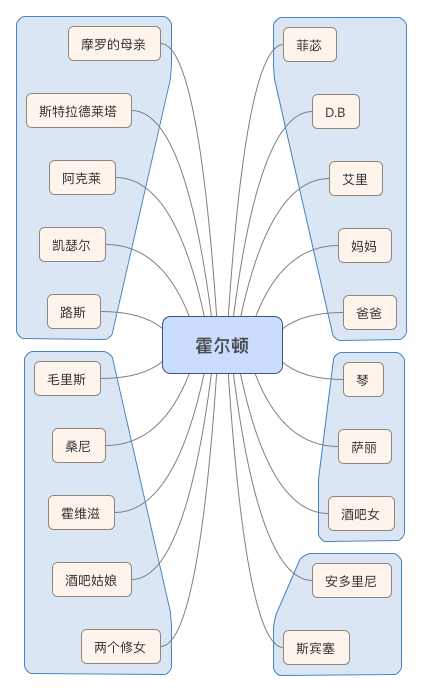

# 《麦田里的守望者》

## 作者简介

**J·D·塞林格**：一九一九年生于美国纽约城，父亲是犹太商人，家境相当富裕，学生时期主要在军校度过，毕业后被安排去学做火腿，没多久又回到纽约读书，先后进了三个学院，但都没有毕业。一九四二年到一九四六年从军。一九四六年复员回到纽约，专门从事写作。塞林格从军校念书时期就坚持写作。《麦田里的守望者》是塞林格的成名作，发表于一九五一年。成名后的塞林格离群索居，成为著名的遁世作家。崇尚东方神秘主义，很少与外人交流，他本人和亲友对于他的生活和写作近况讳莫如深。塞林格死于二零一零年，在他本人的要求下，还有一些作品至今未出版。

## 小说

### 时代背景

小说中的美国正处于处于苏美冷战时期，物质文明丰富但社会风气压抑。有些人粉饰太平，过着浑浑噩噩的日子；有些人看不惯庸俗、虚伪的世道，想要反抗，却找不到光辉的理想。有些年轻人以消极的方式（主要通过酗酒、吸毒、群居等颓废的方式）对现实进行反抗，这些年轻人被称为“垮掉的一代”，“垮掉的一代”后来在美国发展成嬉皮士运动。其中大家可能比较熟悉的人物形象有《阿甘正传》里面的女主珍妮，甚至还有苹果之父乔布斯也深受“垮掉的一代”的嬉皮士思潮影响，进而崇拜东方哲学和禅宗。不过按小说的出版时间和人物活动的背景，应该是“垮掉的一代”的前期，主人公表现更多的也是叛逆和愤世嫉俗，没到酗酒、吸毒、群居的程度。

### 人物关系



### 人物介绍

> 按出场顺序

**霍尔顿**：美国富裕中产阶级家的孩子，爱憎分明，愤世嫉俗，内心有点孩子气，喜欢童趣。他反感任何形式的争斗，极其厌恶假模假式、假仁假义，渴望他理想中的简单而有趣。用现在流行的话说，霍尔顿只想做个“安静的美男子”。

**斯宾塞**：上了年纪的历史老师，跟霍尔顿讲人生是一场球赛，想给霍尔顿一些帮助，却不认真听霍尔顿说的话，无法理解霍尔顿，也谈不上愉快的交流。

**阿克莱**：无聊又自私的隔壁室友，不爱干净不讲卫生。

**斯特拉德莱塔**：极度自恋的室友，表面风度，实则下流，有些轻视女性。

**琴**：琴是霍尔顿在一个暑假认识的好朋友。他们在一起度过了一个愉快的暑假。霍尔顿很喜欢琴，记得很多跟她在一起的细节。

**艾里**：艾里是霍尔顿的弟弟，在12岁的时候死去了，曾经跟霍尔顿、菲苾三个人很开心的在一起。霍尔顿说艾里是个聪明的孩子，富有热忱，喜爱诗歌，把诗歌写在自己的棒球手套上。艾里死的时候，霍尔顿感到非常难过，甚至有点发狂。

**凯瑟尔**：家境不太好，有些自卑的同学，性情耿直，因为其他同学的威逼选择跳楼自杀。

**路斯**：一个相当聪明的人，进了哥伦比亚大学，特别喜欢谈论性问题，霍尔顿和他聊天感觉有点意思。

**摩罗**：一个十足的混账，在他母亲眼中却是个敏感的孩子。 

**桑尼**：霍尔顿在纽约宾馆遇到的应召女郎，没啥特殊，从事皮肉生意，和毛里斯敲诈了霍尔顿五美元。

**毛里斯**：纽约宾馆的皮条客，就是他提出给霍尔顿找应召女郎，联合桑尼威胁加暴力敲诈了霍尔顿。

**霍维兹**：一个有点暴躁的出租车司机，总是很不耐烦，但霍尔顿愿意跟他聊些关于中央公园的鸭子和鱼的事，他至少是个认真听你讲话的人。

**修女**：霍尔顿在火车上遇到的两个修女，只有一段简短的交流。霍尔顿尽自己所能给她们捐了善款。

**萨丽**：萨丽是一个长得挺漂亮的姑娘，是霍尔顿的朋友。但霍尔顿觉得她有点假模假式，有些从众随大流。

**酒吧女**：霍尔顿在酒吧里遇到的三个姑娘。霍尔顿明明不太乐意，但坐在酒吧总不能什么都不干，只好强行撩妹。

**安东里尼**：安东里尼是霍尔顿比较喜欢和信赖的一个老师。是一个年轻而且很聪明的人，很勇敢，抱起跳楼的学生向医务室跑，而且和霍尔顿一样认为**D·B**去好莱坞写剧本是浪费才华。他在小说中跟霍尔顿说了很多经典的话，如“一个不成熟男子的标志是他愿意为了某种事业英勇地死去，一个成熟男子的标志是他愿意为某种事业卑贱的活着”、“多读书，你会发现对人类的行为感到惶恐、恐惧、甚至恶心的，你并不是第一个。在这方面你倒是一点都不孤独。”

**霍尔顿爸爸**：出场次数不太多，应该是个挺有社会地位美国中产阶级。

**霍尔顿妈妈**：小说描述的不多，但提到儿子艾里死后精神有点紧张，情绪有时候会歇斯底里。

**D·B**：霍尔顿的哥哥，是个挺有才华的写作人，在好莱坞写剧本

**菲苾**：霍尔顿的妹妹，霍尔顿最喜欢的人。菲苾单纯可爱，很喜欢自己的哥哥霍尔顿，


### 主要事件

- 击剑比赛

  霍尔顿觉得比赛都很无聊，消极对待。霍尔顿不喜欢集体性的争斗活动。

- 帮室友写作文

  斯特拉德莱塔请求霍尔顿帮他写一篇英文作文，说是只要写一篇描述物品的小文章。霍尔顿很认真的写了弟弟艾里的棒球手套。结果被斯特拉德莱塔吐槽，霍尔顿默默的撕掉了写好的作文，有些失落。

- 和室友打架

  斯特拉德莱塔和琴约会，不仅晚归，还忘了帮霍尔顿问琴是否还会下象棋的时候把国王放在最后排。霍尔顿想起斯特拉德莱塔的以前的下流行径，忍不住多问了些事情。被斯特拉德莱塔戏谑以后，霍尔顿发疯似的冲上去打斯特拉德莱塔。

- 住宾馆召妓

  霍尔顿在纽约酒店待着有些迷茫，稀里糊涂听别人的话叫了一个妓女。但最终还是过不了自己心里那关，终究没有做出那种事来。

- 纽约泡酒吧

  霍尔顿假装成年了去酒吧喝酒。在酒吧遇到三个姑娘，请她们喝酒和饮料，一起聊天跳舞，就为了打发无聊的时光。

- 和萨丽约会

  霍尔顿把漂亮的萨丽约出来，去看自己不喜欢看的话剧。但整个约会并不愉快，霍尔顿还是觉得萨丽是那种假模假式的姑娘，更可怕的是自己为了约漂亮姑娘，也隐藏了自己的不喜欢和反感，表现的假模假式。总之，这是一次假模假式的约会。

- 回忆和琴的往事

  对于琴，小说中更多是以霍尔顿回忆的方式来讲述。在那个暑假，霍尔顿和琴相处的非常愉快，但更多是像好朋友一样相处的，简单而快乐着。霍尔顿记着很多关于和琴在一起的细节。霍尔顿认为男女之间不是非要发生那种关系才能亲近。


### 关键意象

  - 廉价的红色猎人帽
  - 艾里的棒球手套
  - 中央公园的鸭子
  - 送给菲苾的唱片
  - 孩子的笔记本
  - 雨中的旋转木马
  - 学校墙壁上的脏字
  - 小时候的博物馆

### 霍尔顿

  - 四次流泪，每次流泪的原因都不一样。

      - 失望：决定提前离开学校，实在看不惯那些虚伪的人。（P48）
      - 委屈：酒店被社会人敲诈，感觉莫名其妙的被人欺负。（P95）
      - 落寞：纽约酒吧泡吧结束，只能午夜独自在街头游走。（P140）
      - 感动：妹妹拿出所有积蓄，让他感受到真诚无私的爱。（P165）

  - 两次打架。

    > 霍尔顿打架有个特点，他说自己打架的时候不敢看对方的脸，看着人脸就下不去手，而且他也不在乎打架的输赢。由此观之，他的确是一个不好勇斗狠的善良人。

      - 为了琴跟室友**斯特拉德莱塔**打架，**斯特拉德莱塔**是如此的下流，**斯特拉德莱塔**对琴是如此的无所谓，一想到琴在和他约会就难受极了。
      - 酒店内被人敲诈，想反抗却又不够狠，被**桑尼**和**霍维兹**无情的欺负了。

  - 雨中欢笑，开心极了。

    霍尔顿答应妹妹菲苾不离家出走了，在雨中看着妹妹菲苾开心的玩着旋转木马，无拘无束，霍尔顿开心的笑了！

  - 对书籍和爱情的看法

    书籍：真正有意思的是那样一种书，你读完后，很希望写这书的作家是你极要好的朋友，你只要高兴，随时都可以打电话给他。《了不起的盖茨比》

    爱情：霍尔顿对爱情有着朦胧的向往，虽然不知道是什么，但很清楚什么不该做。这种事情，没发生没经历的时候，谁敢说自己知道呢？

  - 对学校教育的评价

      安东里尼告诉霍尔顿，学校的教育有个好处。当受这种教育到了一定程度，就会发现自己脑子的的尺寸，以及什么对他合适，什么对他不合适。过了一个时期，就会心里有数，知道这样的尺寸的头脑应该具有什么类型的思想。这样可以节省不少时间，免得去瞎试一些对自己不合适、不贴切的思想。慢慢就会知道自己的正确尺寸，恰如其分地把头脑武装起来。

      萨丽告诉霍尔顿，虽然学校存在他说的那些，但还是有不少小伙子在学校里学到了更多更好的东西。

      霍尔顿觉得现在的学校里就是一些下流的伪君子，自己待在那里，要么变得跟他们一样，要么自己难受的度过每一天，这是他无法忍受的，自己无法改变这些，就选择离开。处于青春期的霍尔顿有强烈的的反抗精神。

  - 为什么叫《麦田里的守望者》？霍尔顿怎么会想到要做个麦田里的守望者？

    > 不管怎么样，我老是想像一大群小孩儿在一大块麦田里玩一种游戏，有几千个，旁边没人——我是说没有岁数大一点儿的——只有我。我会站在一道破悬崖边上——我是说要是他们跑起来不看方向，我就得从哪儿过来抓住他们。我整天就干那种事，就当个麦田里的守望者得了。我知道这个想法很离谱，但这是我惟一真正想当的，我知道这个想法很离谱。
    
    其实“麦田里的守望者”是霍尔顿的突发奇想，在小说中霍尔顿还提到出家，那时候他还没想到要做“麦田里的守望者”。在纽约街头看到刚从教堂出来的一家三口人，孩子踩着街边的马路牙子走，嘴里唱着“你要是在麦田里捉到了我”，父母在一旁聊着天说着话，这一切看起来是如此的和谐愉快。这给了霍尔顿灵感，这样才有了后来霍尔顿对妹妹菲苾说自己想做“麦田里的守望者”。事实上霍尔顿听错了孩子唱的歌，原诗歌是 罗伯特.彭斯的《你要是在麦田里遇到了我》，孩子唱的歌和小说主旨美太大关系。
    
    倒是一位中国网友——留年向北结合小说内容，写了如下的一首小诗：
    
    ```
    这里不是家
    你却是生长根茎的影子
    习惯把自己养在金黄的梦里 
    我在你的世界练习降落  
    不谈金钱 权利和性
    只开着一扇干净的窗户
    ```
    
    ```
    折射低飞的阳光
    我们成了假模假式中
    两尾漏网的鱼 
    不能跳舞 不能唱歌 不能暴露
    在这个季节 
    我们适合坐在锋芒的背后
    幻想给世界灌输一点点酒精
    ```
    
    ```
    你要是在麦田里遇到了我
    我要是在麦田里遇到了你
    我们要是看到很多孩子
    在麦田里做游戏
    请微笑 请对视
    态度都浮在生活的措辞里
    我们都活在彼此的文字里
    ```


  - 为什么霍尔顿最后没有离家出走？

    霍尔顿在纽约游走的时候，感觉身体有点不适。霍尔顿想起了艾里的死亡给他带来的打击，他想了自己要是得肺炎死去会怎样，他自己倒不怕死，他最担心的是妹妹菲苾知道他死去应该会很难过。所以他决定约出菲苾，再跟她待一会，把钱还给她，然后离家出走。让他没想到的是，妹妹菲苾竟然收拾好东西要跟他一起走。为了跟他一起走，菲苾答应不带很多东西，当知道不可能带她走时，菲苾真的生霍尔顿的气了。是妹妹菲苾真正感动了霍尔顿，答应妹妹菲苾不走了。然后为了哄妹妹开心，霍尔顿带妹妹菲苾去玩旋转木马。在雨中看着旋转木马上开心的妹妹，霍尔顿真的开心的笑了。此刻，霍尔顿感受到的是爱和自由！

## 读后感

《麦田里的守望者》是一篇结构简单明了、人物个性鲜明、叙事方式也很朴实的长篇小说，这也难怪当时能掀起全美国的关注，引来大量青少年阅读和模仿。整篇小说看起来像是主人公霍尔顿的倾诉和牢骚，以第一人称讲述自己的一段经历。他反感社会的假模假式，假仁假义，他的想法和行为得不到关注和认可，只有的他那七八岁的妹妹菲苾认真听他说。霍尔顿喜欢的他的弟弟艾里，喜欢他的妹妹菲苾，身为孩子的弟弟妹妹是如此的真实、如此的简单认真。霍尔顿也喜欢琴，喜欢和她相处的那段时间，关于琴的回忆中总会浮现许多可爱的细节（比如琴下象棋喜欢把国王留在后排，电影院里突然从后面把手搭在他的肩膀上），只有真诚的爱才会留心这种细节，并从中感受到滋味。

霍尔顿的人格是有些矛盾的。他看不惯宾馆里那些下流的住客，但百无聊赖的时候他竟然同意了找妓女。不过他最后还是无法接受跟一个与己无爱的人发生关系，想到自己做的这些，内心无比沮丧。霍尔顿明明知道自己不喜欢萨丽，还有些反感，但还是约她出来看话剧，看自己不喜欢的节目，因为萨丽真的挺漂亮。甚至还跟萨丽说了一大通的胡话，这些话是霍尔顿真实想法，但明显不是要对萨丽说的。霍尔顿清醒过来后竟有些庆幸，庆幸萨丽没当真。最后还假模假式的答应圣诞节要去她家帮忙剪圣诞树。找不到人聊天的时候想到找**路斯**，就插科打诨的聊些性问题。当然，他讨厌这样的自己。

有些事情如果必须经历的话，有机会表达出来可能会好受一些。

霍尔顿对他所处的环境有怒，但绝没有恨，他真是一个善良的人。的确，他有一些孩子气，还有一些敏感，霍尔顿关心那些他觉得有趣的人和事，他爱憎分明，骨子里的感性，有着单纯的愿望。霍尔顿从来没说要改变别人，改变环境，反而是其他人想把霍尔顿变成他们想要的样子。他有懵懂的一面，总觉得社会人情不应该是这样，但也不知道自己想要的是怎样，只能以自己幼稚的方式来反抗。对于所处的不满，如果大家都选择沉默和同化，那将是多么的无趣和令人沮丧。

做一个“麦田里的守望者”在大多数人眼里看来显然算不上某种事业，“麦田里的守望者”既不会让你英勇的死去，也不会要你卑贱的活着。但谁规定一个人就一定要为某项事业英勇的死去或者卑贱的活着？我觉得总想着“英勇的死去”或“卑贱的活着”的人总归是有点问题的，甚至有点危险，有点说不清道不明的私心！

初读本书正值十五六岁，跟霍尔顿差不多的年纪。当时一气读完，感觉作者就是在说你想说的话，抒你想抒的情。因为某些原因，突然想再看看这本书。再次认真阅读已是十年之后，此时再看少了一些感受，多了一些理解。十年光阴是什么塑造了现在的我？而我在这十年间又影响了什么？细细想来，这本书跟我还是有点渊源的。马上就要开启下一个十年了，却还是心中无路，一望无边。

弃我去者，昨日之日不可留；

乱我心者，今日之日多烦忧。

All those moments will be lost in time，like tears in rain！