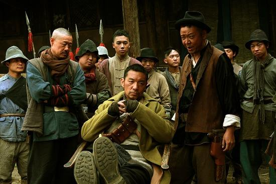
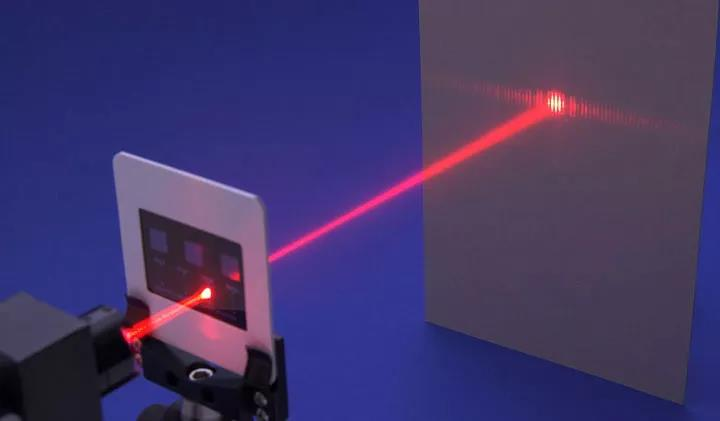

<https://www.madewill.com/thinking-model/理解财富你拥有最宝贵的财富是什么？.html>

# `转载`理解财富|你拥有最宝贵的财富是什么？

**如何才能财富自由？**

我猜你在某个时候一定问过自己上面这个问题，也许就在此时此刻，它正萦绕在你的心头。

但我在回答你之前，想先问你另外一个问题：

**你打算用什么来交换？**

**很多人一辈子都在想如何发财，但很少想过用什么东西去交换…**

**而获得财富的基础，就是交换。**

时光退回到5000年前 ，我们来看个例子，假如我们把时光倒退到5000年前的农耕文明时代…

**你是个村里有名的鞋匠，但是最近家里的粮食快吃完了，你打算去弄点粮食来，**这个时候在你面前有3个选择：

**第一：**自己种；

**第二：**去偷、去抢；

**第三：**做一双鞋子去和需要鞋子且有余粮的人交换；

**自己种**太慢了，现在播种，等种出来早就饿死了；

**去偷、去抢**的话风险太高，搞不好命都没了；

还好，你是个鞋匠，可以拿鞋子**和别人换粮食**啊！

于是，你就做了一双新鞋子，找到了一户有余量的人家，换来了粮食；

**又过了两周**

天气忽然转凉，眼看马上就要进入冬天了，你发现自己的衣服又破又旧，家里也没有其他厚衣服可穿，因此，**你又想要一件新的厚棉衣，怎么办？**

**你的面前还是3个选择：**

**第一：自己做一件**

但是自己不是裁缝，而且并不知道去哪里搞来布料；

**第二：去偷、去抢**

嗯，这个风险还是太高了，不敢去…

**第三：继续做一双鞋子**

然后找到需要鞋子且有多余新衣服的人去交换；

根据上一次的经验，你又如法炮制，很快便拥有了一件新衣服。

**发财的机会来了**

经过这两件事，聪明的你就发现，只要不断的做鞋子，并且把鞋子做的越来越好，然后交换给其他需要的人，就几乎可以换来任何你想要的东西！

于是，你拼命的做了好多又耐磨、又好看的鞋子，然后不断的跟人去换这换那。

**很快，你开始变得越来越“富有”…**

**所以，获得财富的基础是“交换”。**

**等等，你可能发现了一个问题**

刚才你没选择的第一，第二个方案，不就是没有通过交换而得到这个想要的东西的吗？

如果我真的自己做出来了？或者去偷、去抢没有被抓到的话，**那我获得财富的途径不就是没有通过交换吗？**

**选择第一个方案**

看似是自己把需要的东西从无到有的制作出来的。

但其实，你是用了自己的【时间】**+** 【劳动力】**+** 【为了得到种稻谷的种子和做衣服的布料所付出的各种“时间”和“实物”成本】…

**因此，同样是需要通过交换得来的。**

而且这种效率太低，从原材料收集到加工制作等等都自己来，得用**很多的时间**去交换，才能得到一件你想要的东西。并且，还可能因为你的**不专业**而制作失败…….

所以，**农耕文明之后发展出来的专业化分工的社会协作方式，是整体财富爆发式增长的最核心原因**。

**那选择第二个方案呢？**

看似是空手套白狼的方法，只要不被抓住，就几乎没有任何成本。

但其实，你是用你自己【有可能被抓到的风险】**+**【常年锻炼出的武力】**+**【自己可能因此而受的伤】**+**【为此携带的道具、武器】**+**【作案的时间】**+**【去之前的准备、练习的时间】去交换的…

你去偷越多次，你交易出去的**被抓到的风险**就会越高。因此，一旦被抓到，你受到的刑罚也就会越重；

你交易出去的**创伤**也会越来越多，因此你可能会伤痕累累；

你为了**作案效率**能更高，你可能还会苦练偷盗技术、增强武力、购买兵器刀刃…..

如果，你在这条路上越来越专业，作案效率越来越高，从理论上讲，你也可以因此**交换**到任何你想要的东西，让自己变得富有。

只不过，你为此交换出去的**潜在风险**越积越多。之后，你可能会需要组建一个团队来帮助自己了，一方面可以提高作案成功率，人多力量大嘛！一方面，还可以通过团队的力量来有效的抵御潜在风险。

不过，这又会增加一笔**管理成本**，还有作案成功后兄弟们的**分赃**，这些也是**交换筹码**

终于，你变成了一名恶名昭彰的“**土匪帮老大**”….

**所以，就算是去偷，去抢，本质上也是一种交换，而且成本并不比做鞋子低。**

**我们把目光拉回现在**

现在你知道了**财富的基础是交换**，想要获得任何财富，其实都是交换的结果。没有付出，就不可能会有回报。

**我们回到开篇的那个问题：**

**你想要财富自由？****那么你打算用什么来交换呢？**

既然是交换，那你就得拿已有的东西去换，而且越宝贵的才能交换到越好的东西，对吧？这是很简单的道理。

那么问题来了，**什么是你与生俱来便拥有的最宝贵的财富呢？**你拥有最宝贵的财富是什么？

**金钱？**

金钱本身并不属于你，也是你通过交换得来的。金钱本质上是属于一种方便交换的**中介物**，比如你还是一个鞋匠，你会做鞋子，你想要吃苹果，然后你就去找需要鞋子的种苹果的人，结果拥有苹果的人都不需要鞋子，或者他觉得一个苹果需要10双鞋子来交换，你怎么办？

于是，**货币**便诞生了，大家都认同这个叫**金钱**的东西可以作为所有东西的**兑换对象**，并且让所有的东西都有一个统一的价值衡量标准。

**所以，金钱并不是你的财富，而是你已经交换出去的那部分财富的数字存在形式而已。**

**时间？**

时间其实也并不属于你，它就在你我身边自顾自的往前流走，你无法左右或者使用它，**你只能和它做朋友；**

**身体？**

嗯，身体确实可以算作是你与生俱来的财富，你也可以用你这个身体去交换一些东西，比如说提供劳动力或者是其他服务什么的，但是这并不是你最宝贵的财富，**因为身体会慢慢老去，能交换的价值也会越来越低，而且用身体交换得来的财富量很有限；**

**大脑？**

不会思考和没有创造力的大脑是没有价值的，而你有没有思考过，你的思考能力、创造力又是如何获得的呢？**是不是也是通过某种交换形式获得的？交换出去的是什么呢？**

**那到底什么才是你拥有的**

**最宝贵的财富？**

**答案是：** **注意力**

啥？为啥是注意力？注意力怎么会是我的财富呢？

**我们来举几个例子简单说明一下**

**比如说，你想赚钱**

在当今这个社会，最简单的方式就是去工作，所谓的勤劳致富。但你只是在办公室里坐一天是没用的，你会因为没有任何产出而被开除，你得把你的注意力集中在需要完成的事情上，然后用自己的经验、学识去解决问题，再用你完成的工作去兑换工资收入。

**那你的经验和学识又是怎么来的呢？**

对了，就是你曾经用注意力在课堂上，在工作中兑换而来的。

**再比如说，你想拥有一段良好的亲密关系？**

那你就得把你的注意力放到伴侣身上，关注ta，关心ta，而不是只把身体和金钱给对方，留下自己的灵魂在外面随风飘摇，那是换不来长久的幸福的。

**最终，你的一切价值创造活动，都将是由你的注意力交换而换来的。**

想一想，唯一你与生俱来的，你可以自主控制的，并且还能拥有生产力的，除了注意力，还有什么？没了！

**注意力，是你拥有最宝贵的财富！**注意力的财富价值有多大？

在量子力学中有一个非常著名且诡异的实验：“**双缝干涉实验**”，相信你在高中的物理课上一定有印象，这个实验排在了世界十大物理实验之首。

实验形式如上图，具体过程在这里就省略了，你可以自行百度，为了简化烧脑的数学证明部分，我直接说结果：**在你不做任何观测的时候，光是以波的形式存在的，但当你用任何的方式观测的时候，光又变成了粒子形态！**

换句话说，**你观测的这个行为本身，影响了客观事物！**

而我们世界上所有的物质都是由基本粒子组成的，**那么是否也就意味着在现实世界中，我们的注意力，观察事物的这个行为，同时也影响到了被看到的事物本身？**

**荒谬而又千真万确**

**确实是这样的，特别是在互联网的时代，已经把这种效应给数据化了。**

比如，你阅读一篇公众号文章，文章的底部就会记录【**阅读数+1**】，而如果这篇文章获得了非常多的阅读量，那么他就可以把**你们的这些注意力所产生的阅读量**，打包一起卖给广告商。

现在一条10000左右阅读量的文章，大约价值8000元，换句话说，你只是看了文章一眼，其实就帮助到对方增加了0.8元收入！而如果大家都不看这家公众号发的文章，这个公众号也很快会走向衰亡……

**所以，你看一眼，它生，你不看，它死，你的关注与否，切切实实影响到了对方的收入，乃至生死….**

**别人关注你也会有类似的效果：**

如果有一位美女，每天把她的大部分注意力放到你身上，你就会有幸福的感觉，并可能因此而收获一段甜蜜的爱情；

而如果有几十万人在关注你的动态，那你可能已经成为了一名网红，会有大批商家排队给你送钱；

这就好比你是一个在不断发射能量的超人，**当你的注意力关注到什么的时候，就是在给它输送能量，你就是在改变着它。**你是如何花费注意力的？

**那么你现在回想一下，你平时把自己这个最宝贵的注意力发射到哪里了呢？**

**第一种情况：浪费掉**

比如有些人，走在大街上看到一群人围在一起，就不自觉的会凑过去看看发生了什么…..其实你稍微用脚趾头想一下就知道，肯定是和你没关系的事…

还有些人喜欢八卦，某某明星出糗了！某某明星出轨了！某某明星出事了！…. 然后就开始疯狂百度整件事情的前因后果，恨不得把和这件事情相关的，和这个人相关的所有细节全部收集齐全，然后到处和人透露你所知道的“幕后消息”….俗称吃瓜群众，闲得慌…

还有些人，整天谈论国际局势，国家大事，一会儿伊拉克的战争局势，一会儿我们国家的宏观经济最大症结，一会儿应该出台一个什么政策来抵御房地产的泡沫…各种诸葛亮在世，仿佛所有国际难题都能在他们的谈笑间灰飞烟灭…

这些事，要么是离你太远，要么是你无法影响的事，你的注意力甚至根本触及不到他们，**就像是把这份能量射向了天空，完全被浪费掉了。**

**第二种情况：被收割**

既然你的注意力那么值钱，那么一定会有人利用这个来赚取暴利。

在美国有一本畅销很多年的书，书名就叫做《注意力商人》，非常赤裸裸的告诉你，对，我就是要把你的注意力以极低甚至免费的价格收割过来，然后高价卖出，赚取暴利！

书中列举了一系列的方法论，目的就是要想尽一切办法把你吸引过来，并且留住你，让你看上瘾！比如越低俗的内容，越反常的谣言，越可怕的消息….越能吸引你的注意力！

**真不真不重要，对不对不重要，你看不看才重要！**

你看的报纸、看的电视节目、综艺节目、浏览的网页、追各种剧、阅读公众号….这些看似免费的内容不断的围绕在你的周围，几乎无死角的对你进行轰炸，24小时全天候的争夺着你的“注意力”。

一旦吸引到了你的注意力，马上就被无情的收割掉，然后和其他一起被收割的注意力打包卖给广告商，谋取暴利！

为什么现在一个拥有100万粉丝的微信账号、微博账号那么值钱？

因为一旦你选择了**关注**某个公众账号、微博账号，就意味着对方已经**锁定**了你未来部分确定性的**注意力**。

那么，既然可以几乎肯定你未来的某部分注意力会来到我这里，甚至多次来到我这里，那么我自然可以把这部分**未来确定的收益，**以更高的价格打包出售。

**第三种情况：被利用**

你在互联网上的任何注意力投放，几乎都会被完整的**储存**下来，并通过对你的大量**注意力轨迹**进行分析，这样我们就能够更了解你，知道你更愿意把注意力花费在什么内容上，那么我们就可以针对你投放更多这方面的内容给你看，继续收割你更多的注意力…

或者把这个分析结果直接卖给其他商家，告诉他们你爱看这些内容，他们就可以用这些定向内容去更高效的收割你的注意力….**这个就是大数据分析。**

既然你的注意力，会对被关注的事情产生客观影响，那么我们是否就可以利用这一点，故意让你看到我们想让你看的东西，并达成我们的目的？

答案是：当然的。

**比如，2016年的美国大选**，特朗普就利用社交网络和大数据分析技术，对于某些还处在摇摆阶段的选民刻意投放有倾向性的内容，导致选举向更有利于自己的方向发展…

**因此，在这样的一个注意力稀缺的时代，你不珍惜，自然有人会“替你珍惜”，你不管好自己的注意力，你的注意力就就会随时被其他人收割，利用….**

你每天的注意力固定就只有那么多，从这点望去，其实所有人都很公平。**最终，你的一切价值产出，都将是由你的注意力交换得来的，所以，人和人财富的不同，究其根源，都是由每天如何分配注意力的去向所决定的。**

无法有效管理好自己的注意力，结果可能不仅限于是将自己最宝贵的财富拱手送出，让别人收割和利用，**甚至可能导致更严重的后果：**国内曾对1292名违法犯罪青少年调查，发现其中有978名学龄期曾被诊断为多动症，患病率为75%。部分病例成年后，还留有性格和行为缺陷，这就是注意力缺陷障碍（ADD）。

所以，如何管住自己的注意力，如何把你最宝贵的注意力投放到最有价值的去处，**长期积累下来所导致的财富差距、生活品质差距可能有数百、数千甚至数万倍以上！****应该如何花费你的注意力？**

**那我们应该将我们的“注意力”花在哪里呢？**

**一、人际关系，特别是亲密关系**

建立自己的人脉圈可以提高自己调动资源的能力，现在的很多机会往往都不是一个人的力量可以抓住的，而是需要团队协作，需要资源支持的。

因此，你日常生活中就需要去有意识的将你的注意力“投资”到这些人脉关系中，至于具体什么方法，这个我们以后会讲；

还有就是亲密关系，如果你把所有的注意力都花在对外的工作上，而很少放到家庭和亲密关系上，那么亲密关系的恶化几乎是必然的，**而亲密关系的破坏，对你所有其他方面的影响几乎可以说是毁灭性的重创！**

**二、新趋势**

**趋势的力量，在大多数情况下远远大于个人的力量，这个以后我们详细讲到。**

**关注新趋势的目的并不一定是为了寻找新的机会，而是不做井底之蛙。**

避免自己有一天发现一个看似是“机会”的机会，然后舍生忘死的投入其中，殊不知这些别人早就做过，并且已经宣告失败了；

或者你看到的这个机会，其实它已经落后了；

又或者你看到的这个机会，其实已经有很多人都参与其中，你只是许多随大流中的渺小一员。你若对此有的只是一腔热血，而缺乏必要的专业素质和资源支持（比如近期很火热的区块链），那么结局除了当个炮灰，几乎没有其他可能。

**三、聚焦当下**

聚焦你的工作或者能产生价值的这件事情上….这点不必我多说

**四、自己的成长**

**这也是最最重要的一点：****你应该把剩下的所有注意力，都花在“自己的成长”上！**

为什么最多的注意力要花在自己的成长上？不是应该是当下的工作和能产生收益的事情上吗？

**人和人的注意力所产生的效果是不同的，是有能量密度高低的。**

**你**关注到“新能源汽车”这个行业上，和**马云爸爸**关注到“新能源汽车”这个行业上，对这个行业所产生的影响都是有数量级的差别的。

经常听到有句话叫做：“**隔行如隔山**”，意思是说跨行是件很困难的事，但是在如今这个时代，我们却经常听到“**跨行打劫**”，“**跨界创业**”等的成功案例，为什么？现在行业与行业之间的鸿沟变小了吗？

并不是，你去查一下这些跨界打劫、跨界创业成功的人都有些什么共性？

**他们都是自身“能量很强大”的人。**他们在跨界之前就已经获得过成功，他们的经验、能力、学识，积累的资金、资源、人脉，都能为他的注意力附能。他一天也只有24小时，但同样是一分钟的注意力所产生的能量就要大很多。因此他们跨界成功率也变得比普通人要高出很多！

**那你如何也能成为一个**

**能量很强大的人呢？**

**将注意力投射到自身成长上，就会提升自己的能量密度。**

比如，**每天看一小时书**，来丰富自己的知识面；

比如，**每天写一篇日记**，总结一下今天的得失；

比如，**每天写一篇分享**，把自己的所学**吐**出来，帮助别人的同时，巩固自己的学识…

一开始这种方式，可能会效果很微小，不明显，甚至根本察觉不到变化：我只是今天多了1小时看书嘛，我并没有发生什么变化呀，我还是我，是不一样的烟火~

但是，注意力能量密度的提升是符合**指数增长**的特质的。你每次的投入，都会带来微小比例的增长，虽然比例很小，哪怕每次只增长1%，但如果坚持1年，你的能量密度会增长多少倍呢？

**37.8倍！**

对的，每天只是多看一小时书，每天只是进步一点点，哪怕只有1%，一年之后，你比你之前的自己厉害了38倍！

因此，最终人与人的差别不是我们通常感觉的只有数倍的差别，而实际上是数量级的差别，是数百倍乃至数万倍的差别！

**最可怕的事情莫过于**

**比你优秀的人，还比你更努力！**

**将注意力尽量都花在自我成长上，你将会获得最高的投入产出比，这也许是你这一生听到的最重要的一条建议。**

而那些整天管不住自己的注意力，将它们随意浪费掉，被别人收割掉，被别人利用….而从不把注意力放到自己身上的人，如果他们能获得成功，那么天理何在？

我们再次回到本章开头的那个问题：“我如何财富自由呢？”

**答：用你的全部注意力来交换吧！**

课后作业

**看完 ≠ 学会**

**你还需要思考与实践**

**1.** 罗列一下过去的一天你是怎么花费你的注意力的？哪些是和你有关的，哪些是对成长有关的？

**2.** 罗列一下过去一周的呢？一个月的呢？哪些是和你有关的？哪些是无关的？

**3.** 基于你目前的情况，你觉得如何安排你之后每天的注意力花费是最合理的呢？如果可以的话，可以把你的注意力花费清单列出来，分享给我们