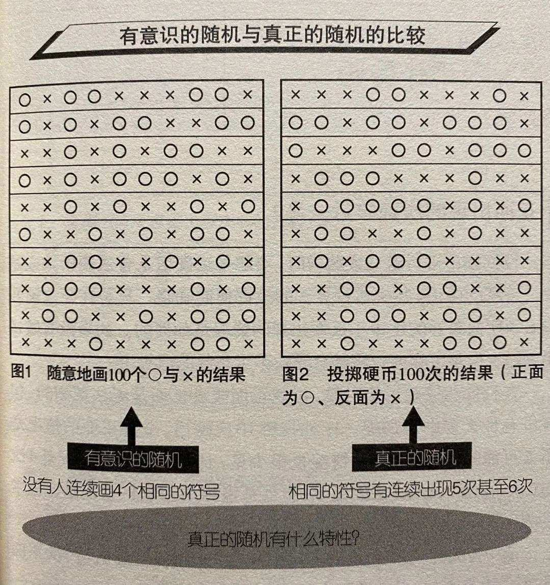

https://news.futunn.com/post/8087047?topic_idx=127&src=10&lang=zh-cn

# `转载`复利的谎言

十年赚10倍，靠谱吗？

假如你买了茅台股票并拿几年，就有10倍。

或者买特斯拉or蔚来汽车的股票，不到一年，你就能赚10倍。

「tenbagger」 一词出自世界级投资大师——彼得.林奇的自传《成功投资》一书，意译为「能翻10倍的股票」。

有人算了一下，假如你想在股市十年变10倍，每年「只」要26%回报即可。

于是，关于复利的传说，又多了一个美妙的数字：26%。

然而，假如你相信如上「复利法则」，也许就掉入了一个谎言的陷阱。

不止在投资领域，关于个人的「成长」和「精进」，也流传着一年抵N年的梦想。

最近，有人问我：

- 一个人可以做到持续地每天进步百分之0.1或者说百分之0.05吗？
- 如果可以或者说有可能达成的话，关键点在哪里呢？难点在哪里呢？

我回答：不可能。

我小时候曾经得过一本武林秘籍，上面介绍了一种看起来很靠谱的方法，让人学会「飞檐走壁的轻功」。

具体方法是：

- 挖一个大坑，在里面垫很多层草席，一次垫到接近地面；
- 每天锻炼跳出地面，直至轻松自如；
- 取掉一张草席，继续锻炼......
- 再取掉一张......

每层草席才多厚呀，这样，你就神不知鬼不觉战胜地心引力，掌握绝世轻功了。

可惜，少年的我胸无大志，没有亲身实践。

你看，这是不是也是「复利思维」的一种简化版？

「复利思维」，这个看似有些鸡汤的话题，其实包含了「不确定性、连续性、对称性、预测、幂律分布、肥尾、下注、决策、贝叶斯、长期主义」等好多个有趣的话题。

本文的观点是：

- 绝大多数人对于复利的理解是错误的；
- 极少有人能够靠复利获利。

以下，是复利谎言背后的10个真相。

# 真相 1：世界被随机性主宰

未来是极度不确定的。

并不存在一个清晰的轨迹，让你像爬坡一样每天进步一点点。

先来看看随机游走假说。

这是金融学上的一个假说，认为股票市场的价格，会形成随机游走模式，因此它是无法被预测的。

- 1863年，法国的一名股票掮客朱利·荷纽最早提出这个概念。
- 1900年，法国数学家路易·巴舍利耶在他的博士论文《投机理论》中讨论了类似观念。

另一条主线是，爱因斯坦在他1905年的一篇论文中，从物理界的角度出发研究了「随机过程」，揭示了布朗运动，间接证明了原子和分子的存在。

回到金融。又过了整整半个世纪，1953年，莫里斯·肯德尔提出：

- 股票市场价格的变动是随机的主张。
- 1964年，史隆管理学院的保罗·库特纳出版了《股票市场的随机性质》。
- 1965年，尤金·法马发表了《股票市场价格的随机游走》，正式形成这个假说。
- 1973年，普林斯顿大学波顿·麦基尔教授出版了《漫步华尔街》。

我很早以前看过这本书。很坦率地说，极少有人能够第一次就读懂并接受麦基尔苦口婆心的观点：别瞎折腾了，买点儿指数基金吧！

即使你读懂了，也不甘心照他说的做。

这本和我一样老的书里，许多洞见今天看起来也闪闪发光，例如谈及对基本面的专业分析未必靠谱，作者写道：

> 无数研究都显示了与此类似的结果。放射科专家在观察x光片时，竟然让30%具有肺病症状的光片从眼皮底下大大方方地溜走，尽管这些x光片已清清楚楚地说明了疾病的存在。

另一方面实验证明，精神病院的专业人员竟然不能把疯子从智者中分离出来。

随机性是个太大的话题。

笨人很难理解随机性这回事，而聪明人总觉得自己可以控制随机性。

例如，我在澳门赌场里观察了一阵子，发现在押大小的赌桌前，假如连续出现了十次大，那么：

- 新赌徒们就会继续跟着押大，认为大的火气正旺；
- 老赌徒们则会押小，他们认为根据大数定律出现小的概率更大了。

可惜，二者都错了。新赌徒们迷信，老赌徒们犯了「小数」的谬误。

一个公正的大小游戏，每一次或大或小是没有记忆的。

对于随机性里关于「无记忆」的这部分，人类的大脑很难接受。

例如，假如让你扔100次硬币，下面哪个结果更「真实」？

上图左侧是请某个人类「随机」画的，是有意识的随机；

上图右侧是真正的随机（应该是模拟的）。

看起来，是不是左边更随机一些？

因为右侧有太多「连号」，看起来不够随机。

实际上，恰恰相反。

这就是人类对随机性的偏见之一。

世界是随机的，并不符合「决定论」，更不是线形的。

「复利思维」为什么看起来如此有吸引力呢？

因为「复利」制造了一种虚幻的确定性。

我们的工作、生活、投资，大多是通过寻求事实和真相，来寻求生活中的确定性。

但是，什么是确定性？

假如你不能在某个「确定性」之前，加上一个概率数值，那么这个确定性就是一个大坑。

有次我听见儿子在打游戏的时候，和别人说「百分之百确认」，就很认真地对他说：

记住，以后不要说百分之百确认，哪怕某件事你非常非常非常确认，你也只能说我99.999%确认。

进而，你对于事实的「确定性」的判断，本质而言，其实只是某种信念。

人类事务，就是由一大堆信念在随机性的沙滩上堆砌而成的。

# 真相 2：连续性很难实现

复利有一个重要的假设，那就是连续性。

只要你每年赚26%，连续十年，你就可以......

下面，我们来看看连续性有多难。

我在《机会泵：如何管理你的运气？》一文里写道：

你有没有想过，为什么现实中很少有福尔摩斯？

通常而言，福尔摩斯的神奇之处，在于他能够做一连串推理，大致结构是这样的：

因为A，所以B；因为B，所以C；因为C，所以D；因为D，所以E......

所以，凶手就是大魔王！

之所以极具戏剧性，是因为上述一系列推理，就像杂技团的叠罗汉，叠得越高，越有冲击力。

然而，现实中很难见到杂技团的这种极度不稳定结构。

我们算个简单的账吧：

假如福尔摩斯的每一步推理的靠谱度高达80%（这算料事如神了吧，有这种预测能力去炒股票的话很快会成世界首富），那么从A推理到E的靠谱度，就是：

80%✖️80%✖️80%✖️80%=40.96%

也就是说，即使每次推理的准确率再高，经过多个环节的叠罗汉，也变成不那么靠谱了。

对于随机游走的股市投资而言，「连续性」更难实现。

别说连续十年每年回报达26%，就连年化10%，也没多少人做到。

有人根据wind数据分析，全市场只有33位基金经理，连续十年做到年化收益率超过10%。

那么私募高手们呢？

据统计，10年期年化收益率超过10%的私募基金经理，仅有37人。

复利极大地高估了「连续性」。

时间并不是复利的朋友，更多时候是敌人。

- 时间「有先有后」的特性，让我们容易将先发生的作为因，后发生的作为果。
- 时间「自动驾驶」的特性，让我们容易以为事件的发生就像将一个雪球滚下山坡。

然而：

- 时间的先后次序，并不能决定前后的因果关系；
- 时间的连续性，更不能成为事件连续性的燃料或证据。

休谟早就说过，这么想是很幼稚的。

作为「致富工具」的所谓「复利思维」，按照休谟的话说，是取决于我们的情绪、习俗和习惯，而不是取决于理性，也不是取决于抽象、永恒的自然定律。

让我截取休谟的一段话，来击碎复利的「连续性」谎言：

> 「我们就可以问，它包含着关于数和量方面的任何抽象推理吗？没有。
>
> 它包含着关于事实和存在的任何经验推理吗？没有。
>
> 那么我们就把它投到火里去，因为它所能包含的没有别的，只有诡辩和幻想。」

# 真相 3：现实是不均匀的

复利的神话里，还包含着一个假设：

这个世界是均匀的。

然而，现实不仅是不均匀的，而且连「不均匀」的那部分，也很不均匀。

这并非绕口令，而是聪明人对「不均匀」这个概念的多层级理解。

- 第一层级：理解人有悲欢离合，月有阴晴圆缺；
- 第二层级：聪明人试图用「正态分布」来驯服随机性；
- 第三层级：理解幂律和肥尾；
- 第四层级：概率与赔率的不对称性。（这是下一节的内容）

复利神话里描述的那种「每天进步一点点、每年赚一点点，就能成长为巨人」的场景，在现实中并不会出现。

确切说，在现实世界，99%的时间你会感觉一无所获，只有那1%的时间会感觉到收获的喜悦。

即使聪明人理解了随机性，也会过于相信正态分布的钟形曲线，而忽视黑天鹅出现的频率以及导致的破坏。

有些事情是正态分布，或者是薄尾，例如人的身高；

有些事情是幂律分布，或者是肥尾，例如人的财富。

正态分布与幂律分布最大的区别在于，某些现象中，正态分布严重低估了极端事件发生的概率。

再比如，当奥巴马说「我国经济09年以来增长13%」时，有可能真相是：

美国人只有最富的1%收入增长了；

剩下99%的人收入反而比之前略微下降。

原因是：

财富的分布并非正态分布，而是幂律分布；

美国1%最富有的家庭拥有的财富占美国家庭财富总额的34.6%。

我隐约觉得，复利神话对人带来的错觉，可能与「小数法则」有关，同是赌徒谬误。

反过来说，我们在有限的空间、有限的时间、有限的样本量下，高估了大数定律的作用。

大数定律依然起作用，但收敛得可能很慢。如凯恩斯所说的市场非理性的时间比你破产的时间要长。

你也许可以用指数基金来投资，正如博格所说，别去草堆里找针，干脆买下整个草堆。

但是，万一你选错了草堆呢？

不确定性的一部分，正是分布的「不均匀」。

打个比方，就像你开辆车，打算来一次数千公里的自驾之旅，计划一天五百公里，然后艰难而快乐地抵达目的地，享受挑战自我的乐趣。

结果呢？也许前三天走得好好的，第四天就陷入一个沼泽地，完全动弹不得。

我想过一个问题：

假如一个难题是均匀的，那就不算一个真正的难题。

例如，我每天做一百道围棋死活题，一年我就可以升两段。这并不是一个难题。

问题是没有这样一马平川的难题。

假如有，围棋可能就不是一个很难的游戏了。

其实，AI就将围棋变成了一个均匀的难题。

所以满大街都是随便灭掉人类冠军的围棋AI了。

又比如「戈壁挑战」那种人造的均匀的难题，也许只是另外一种精神按摩的商务人士广场舞而已。

# 真相 4：回报是不对称的

我们的世界有太多对称性，例如对称的身体，好与坏，阴与阳，正与负，人类对「对称性」也有很高的期望值。

复利神话，也包含了「对称性」的幻觉。

然而，由于以下两个关于「对称性」的真相，复利神话被戳破了：

1、现实世界里，财富的委托代理机制的权利和责任是不对称的；

2、在数学上，不懂期望值会导致概率与赔付之间的不对称。

塔勒布在《非对称风险》里，提及了人类事务的对称性原则，包括公平、正义、责任感、互惠性。

他尤其嘲讽了金融业的高管们拿别人的钱冒险赚自己的大钱。

该书译者这样写道：

在权利和责任不匹配和非对称的委托代理机制下，代理人只会考虑如何尽可能地延长游戏的时间，以便自己能够获得更多的业绩提成，而不会考虑委托人的总体回报水平。

塔勒布从数学的角度，在概率密度函数中突出了「矩」的概念，揭示了看似能够产生「长期稳定回报」的投资策略其实隐含了本金全损的巨大风险。

看起来大概率低风险的收益，由于不对称性（既有机制上的，又有期望值上的），忽视肥尾和黑天鹅，委托人最终会因遭遇爆仓风险而损失全部资产。

戴国晨在解读《肥尾分布的统计效应》时总结道：

1、重视概率忽视赔付在肥尾条件下会导致更大的问题。

2、肥尾条件下对实际分布估计的微小偏离都可能带来巨大的赔付偏差。

第一点好理解。例如我最近没时间下棋，但会在网上看高手下棋并虚拟下注。我并不是总押获胜概率更大的棋手，而是关注赔率，也就是计算期望值。

从投资看，就是：

一个大概率赔钱的策略不一定是糟糕的策略，只要没有破产风险且小概率能获得巨大收益即可，如尾部对冲策略（例如Universa）；

一个胜率99.99%的策略也不一定是好策略，如果不能完全规避破产风险前期盈利都会归零，如杠杆统计套利（例如长期资本）。

关于第二点，塔勒布给出的是数学解释：

由于存在非线性关系，市场参与者的概率预测误差和最终赔付误差完全是两类分布，概率预测误差是统计量，在0到1之间，因此误差分布是薄尾的，而赔付的误差分布是肥尾的。

稍微总结以上三节，「连续性」的幻觉，对「均匀性」的幻想，「非对称」的风险和回报，经常是财富的致命杀手。

在这三个「不确定性」杀手的围剿之下，复利谎言走不了多远，就粉身碎骨了。

# 真相 5：勤奋无法替代思考

希望每天进步0.1%，进而叠加出惊人的复利，与其说是一种幻想，不如说是试图每天都获得「即时满足」。

复利神话，其实是一种反智的智力贩卖。

为什么呢？

因为要获取世俗上的成功，除了运气之外，你需要两个步骤：

1、做正确的事情；

2、把事情做正确。

复利神话过于强调第二点，让人忽略了第一点。

还有那种「每年只要赚26%，十年能变10倍」的说法，除了教会你一点儿小学数学，实在是害死人。

例如谈起定投，假如你在一件错误的东西上定投，做得再正确也没用。

在捕鼠夹上雕花，你做得再极致也没用。

如果你没有方向，任何方向的风都是逆风。

# 真相 6：「种下树」的惊险一跃

假如说种树是你说的这种「每天长一点点」，然后长成参天大树，枝繁叶茂，那么这里的关键点不是每天长一点点，而是「种下树」这个「充满惊险一跃」的大决策。

这类决策，很难外包。

这方面，投资和教育孩子也有点儿像，你应该做一名园丁，而不是木匠。

在一个充满随机性的世界里，并不存在「设计和打造」的木匠。

对未来的预测，和算命没什么区别。

那些关于所谓周期预测的神话，当事人其实是像算命先生那样，提前说了很多模棱两可的预测。

人们总能从中挑出偶尔对的只言片语。

连一个不走的钟一天都能对上两次呢。

「充满惊险一跃」的大决策，仍然只是一个「信念」而已。

你需要不断更新自己的「信念」，而不是捍卫自己的观点。

并且，你需要有一种这样的心态：种下树，享受这个过程，哪怕你本人不能亲身享受树荫。

## 真相 7：惊涛骇浪里的贝叶斯

所以，厉害的人，本质上是个贝叶斯主义者。

他们能够做到：

随时在根据当前境况重新判断；

打出无记忆的牌；

不介意自打嘴巴；

勇于自我更新。

他们绝非像驴子拉磨那样，以为只要坚持转圈儿就能每天进步。

例如亚马逊的股票，自上市以来年回报率的确很惊人，但是并不是每天一点点稳定爬坡涨上来的，中途经历过好几次大跌，跌到让人怀疑人生。

那么，复利神话的「死磕到底」，不正好可以让人抓住亚马逊的这种大机会吗？

问题是，你怎么知道自己死死抓住的股票是亚马逊？

在复利思维的「指引」下，有些人喜欢用「不断摊薄、加倍下注」的投资方法。这是一个复杂的话题，但大多数时候对大多数人而言，这是错误的做法。

这两年，特斯拉的惊人反弹，会让很多人再次对「死磕到底」与「抓十倍股」产生幻想。

我只能说，从进化的角度，马斯克是有益于人类的。

市场也给予了马斯克和贝佐斯比巴菲特还高的回报。

但是造物主并不是自上而下地设计物种，而是自下而上地「演化」。

马斯克是个好的创新者，但是他作为你的老公，就未必是好的。

当然很多女士会跳起来反对这一观点。

不过我一贯的观点是，女性在择偶上的非理性，从进化的角度看，也保护了物种的丰富性，并且鼓励了一些必要的冒险家。

这些冒险家以个体的非理性实现了人类群体的理性。

# 真相 8：牛人需要「北极星+鸡血」

概括而言，「复利思维」鼓吹持续每天进步百分之0.05，只是追求一种所谓确定性的幻觉，稍微遇到一点儿风雨就被打散了。

此外，厉害的人还要能够在没有任何激励、没有任何「进步迹象」的情况下，依然每天打满鸡血。为什么能做到这一点呢？

秘密在于：他们既有心中的北极星，又敢于走入黑暗的森林。

此外，别忘了，我们人性和社会性。

牛人们会利用人性和羊群效应。

「北极星+鸡血」，帮助他们对资源有更强大的获取能力。

# 真相 9：一边「滚雪球」一边「补血」

复利思维描述的理想化的滚雪球，在现实中经常会掉血。

高手们需要一边「滚雪球」，一边「补血」。

例如特斯拉在中国建厂，蔚来汽车拿到政府投资。

都是生死一线间的「补血」。

为了拥抱大数定律，你需要长期在场，实现遍历性。

所以投资人要讲故事，要制造自己的传说，要持续募集更多的钱。

他们懂资源聚集效应。

当然，这背后自然还有对「概率权」的理解。

职业投资人和业余投资者最大的区别之一，在于职业选手有源源不断的弹药。

巴菲特有保险公司的浮存金，可以发债（不差钱的他今年四月在日本借了18亿美金）。

他还强调所投公司有很好的自由现金流，他有一个极小的总部，只在乎旗下公司的经理人们把赚到的钱源源不断地交上来。

据知情人士称，高瓴2020年上半年正在从投资人那里筹措可能多达130亿美元的资金，准备抓住疫情之下经济当中出现的新机会。

上一次融资是在2018年，最终募集到106亿美元，创造了纪录。

即使牛如巴菲特和高瓴，也在源源不断地获得资金，为下一次下注准备筹码。

只有如此，无限游戏才可以持续下去，英雄一直留在场上，大数定律发挥作用，财富因为遍历性中的概率优势、以及最大化的正期望值得以实现。

这才是「长期主义」背后的道理。

换句话说，他们一边滚雪球，一边不断往前面的雪道上撒雪。

# 真相 10：西西弗斯向上滚雪球

那么，批驳复利思维，这是否定了「滚雪球」的存在吗？

巴菲特不是靠滚雪球成为首富的吗？

人生也许像是滚雪球，可惜不是顺着坡往下滚，而是像西西弗斯那样往山上滚雪球。

而且，这雪球随时可能砸下来。

指数型的崩溃，往往比指数型的增长「容易得多」。

所以，即使我们能够有足够耐心慢慢变富，慢慢成长，也不能令「变富」和「成长」因为「慢慢」而变得容易。 

忘掉复利神话吧。

人类唯一可以什么都不干就增加的，只有年龄（也许还有体重）。

人生就像逆水行舟。

即使你只想做一个防守者，也要主动防守。

为自己种下一些树。

也许惟一能够每天进步一点点的，只有我们的心灵之树。

# 最后

复利神话，是对「躺赢」的另外一种包装。

很不幸，这个世界并没有「躺赢」这回事。

我们将看到越来越多的复利式增长的传说，甚至包括那些巨无霸公司。

然而，我们并不能以此逆向推导，得出脆弱的「因果关系」，去找成功者的秘籍，指望自己也能实现「十年十倍」的神话。

说起因果，休谟否认「每一个事件都有原因」这一命题的必然性。

那么，怎么看「菩萨畏因，凡夫畏果」？

倒是可以从「可证伪性」来看这句话：

菩萨畏因

别去做那些会炸掉的事情。

但是也别指望能找到并复制「成功者」的「因」。

凡夫畏果

即使你种下了善因，而没有得到善果，甚至得到恶果，也要坦然接受。

那些没有杀死你的恶果，往往能帮助你更新自己的信念。

大多数人是要当普通人的。

幸福的普通人比不幸福的牛人更幸福。